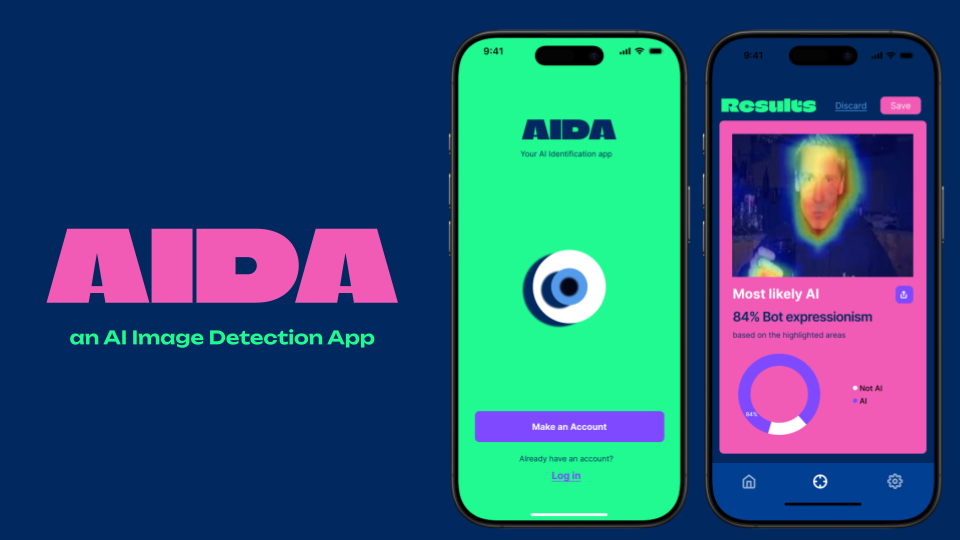
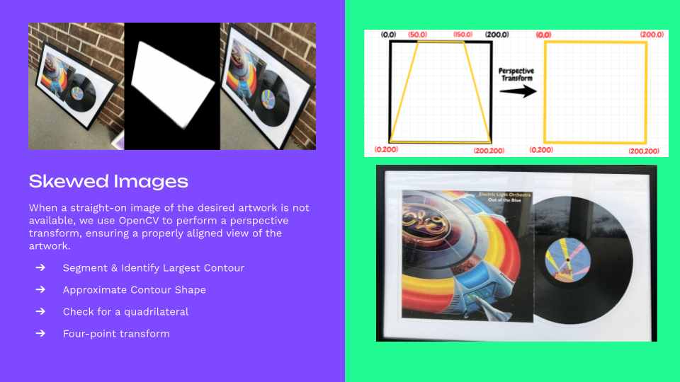
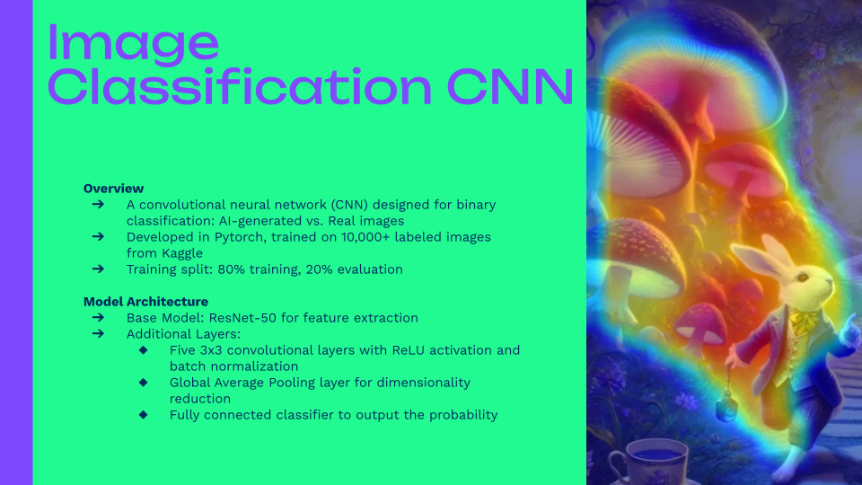
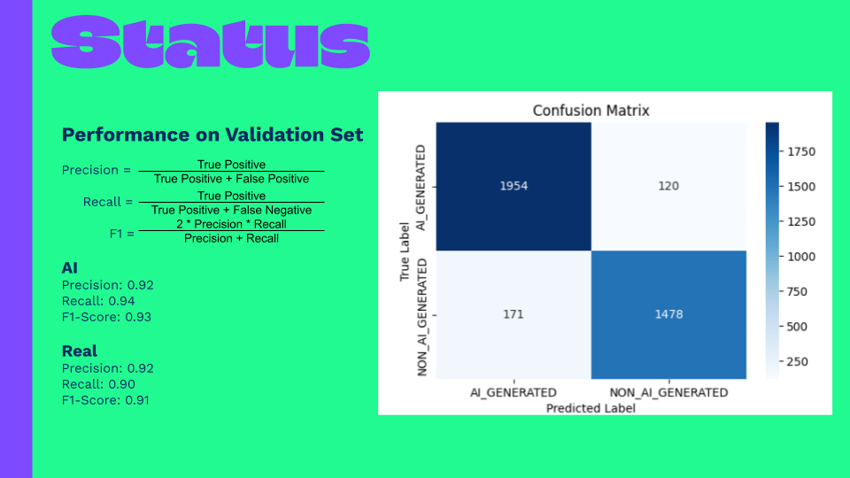
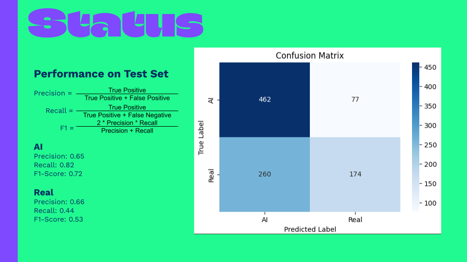

# 📷 AIDA: AI Image Detection App

**Building Detection Technologies to Combat Synthetic Media**

AIDA (AI Detection App) is a mobile application that allows users to scan physical artwork and detect whether it was generated by AI. The app utilizes a U²-Net for object isolation, a custom-trained CNN for classification, and Grad-CAM to visually explain results. Unlike typical detectors, AIDA works on second-order images (e.g., photos of prints or posters) that lack watermarks or metadata.

---

## 📊 Features / Modules

All the different pages go here.

---

## 🏁 Results 

---

## 🛠️ How to Run

1. Clone the repostory in a new folder.

2. cd into the dist folder
cd dist

3. Have Node.js installed and install expo
npm install -g expo-cli

4. run npm install, and npm update if there are any outdated packages.
npm install
npm update

5. start the app. Download any necessary packages.
npx expo start

6. Download Expo Go on your iPhone and scan the QR code to simulate the app
https://apps.apple.com/us/app/expo-go/

7. create a .env file with the following tokens: 
DATABASE_URL
AWS_ACCESS_KEY_ID
AWS_SECRET_ACCESS_KEY
AWS_REGION
AWS_S3_BUCKET
HF_BEARER_TOKEN

---

**Contributors:**
Claire Pielak, Zachary Lain, Chris Stefaniak, Luke Renchik, Savannah Moss

**Institution:**
Department of Computer Science and Engineering
School of Engineering and Computer Science
Oakland University, Rochester Hills, MI

**License**
MIT License
