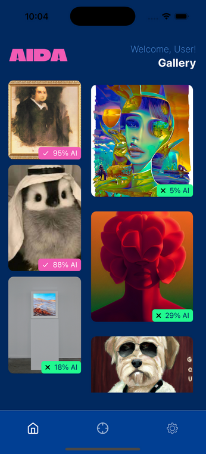

# 📷 AIDA: AI Image Detection App

**Building Detection Technologies to Combat Synthetic Media**

AIDA (AI Detection App) is a mobile application that allows users to scan physical artwork and detect whether it was generated by AI. The app utilizes a U²-Net for object isolation, a custom-trained CNN for classification, and Grad-CAM to visually explain results. Unlike typical detectors, AIDA works on second-order images (e.g., photos of prints or posters) that lack watermarks or metadata.

---

## 📊 Features / Modules

All the different pages go here.

---

## 🏁 Results 

---

## 🛠️ How to Run

---

**Contributors:**
Claire Pielak, Zachary Lain, Chris Stefaniak, Luke Renchik, Savannah Moss

**Institution:**
Department of Computer Science and Engineering
School of Engineering and Computer Science
Oakland University, Rochester Hills, MI

**License**
MIT License
